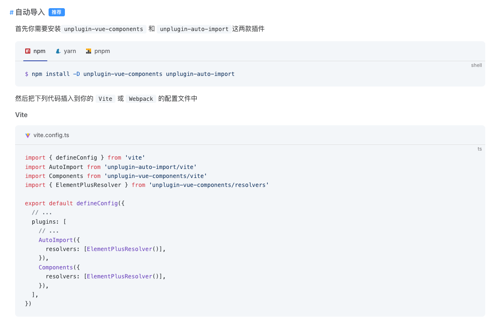

# 组件按需加载

## 目标
实现类似element-plus的按需导入


配置后使用示例
```vue
<template>
  <div>
    <el-table />
  </div>
</template>

<script>

</script>

```
等同于
```vue
<template>
  <div>
    <el-table />
  </div>
</template>

<script>
import { ElTable } from 'element-plus'
import 'element-plus/es/components/table/style/css'

export default {
  name: 'App',
  components: {
    ElTable
  }
}
</script>

```

## unplugin-vue-components
[unplugin-vue-components](https://github.com/unplugin/unplugin-vue-components)为element-plus提供了`ElementPlusResolver`,同时支持我们自己编写resolver
我们只要实现一个供自己组件库使用的resolver就可以了

## 实现

官方提供的实例代码
```js
Components({
  resolvers: [
    // example of importing Vant
    (componentName) => {
      // where `componentName` is always CapitalCase
      if (componentName.startsWith('Van'))
        return { name: componentName.slice(3), from: 'vant' }
    },
  ],
})
```


## 自己实现

`packages/utils/resolver.ts`
```ts
export default function ZyElementResolver() {
  return {
    resolvers: [
      (componentName: string) => {
        // where `componentName` is always CapitalCase
        if (componentName.startsWith("Zy")) return { name: componentName, from: "zy-component-lib" }
      },
    ],
  }
}

```

在index.ts中导出
```ts
export {default as ZyElementResolver }  from "./utils/resolver"
```


### 在play中配置并测试按需引入

```ts
import { fileURLToPath, URL } from 'node:url'

import { defineConfig } from 'vite'
import vue from '@vitejs/plugin-vue'
import vueDevTools from 'vite-plugin-vue-devtools'
import Components from 'unplugin-vue-components/vite'
import { ZyElementResolver } from 'zy-component-lib'

// https://vite.dev/config/
export default defineConfig({
  plugins: [
    vue(),
    vueDevTools(),
    Components({
      resolvers: [
        ZyElementResolver(),
      ],
    }),
  ],

  resolve: {
    alias: {
      '@': fileURLToPath(new URL('./src', import.meta.url))
    },
  },
})

```
运行后效果


# 安装npm包测试
可参考项目test-zy-component，分支stage/01-on-demand-import