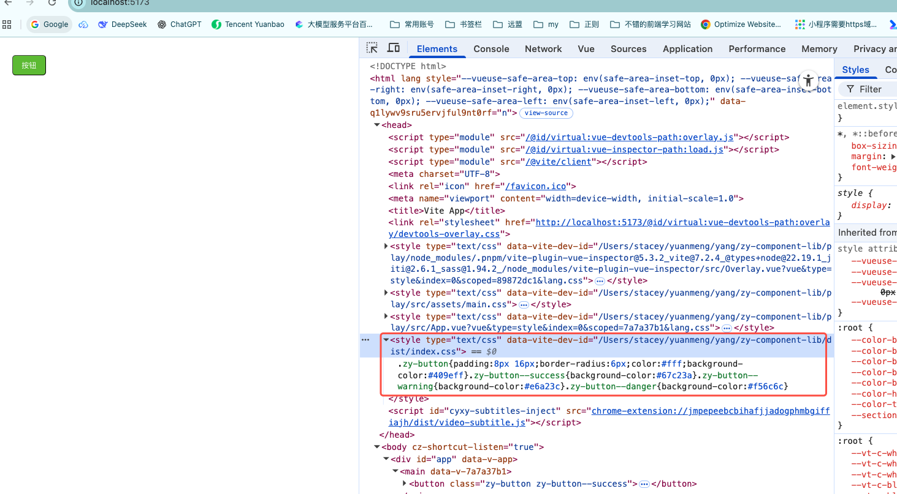

# 样式按需引入

## 目标

- **使用组件时自动引入对应样式**，不需要在 `main.ts` 中手动引入全量样式。
- **多组件同时使用不重复注入全量 CSS**，而是“用到哪个组件就引入哪个组件的样式入口”。

实现方式：基于 [unplugin-vue-components](https://www.npmjs.com/package/unplugin-vue-components) 的 resolver，在返回结果里通过 `sideEffects` 自动注入样式。

## 背景：`sideEffects` 是什么

resolver 返回对象中 `sideEffects` 字段用于自动注入副作用 import（典型是样式）：

```ts
interface ComponentResolveResult {
  name: string
  from: string
  as?: string
  sideEffects?: string | string[] // 自动引入 style
}
```

## 方案 1（入门）：全量样式自动注入（会重复）

### 修改 `ZyElementResolver`

```ts
export default function ZyElementResolver() {
  return {
    type: "component" as const,
    resolve: (componentName: string) => {
      // componentName 是 CapitalCase
      if (!componentName.startsWith("Zy")) return
      return {
        name: componentName,
        from: "zy-component-lib",
        sideEffects: "zy-component-lib/dist/index.css",
      }
    },
  }
}
```

当使用组件时，插件自动生成：

```ts
import { Button } from "zy-component-lib"
import "zy-component-lib/dist/index.css"
```

### 验证

运行 `play` 查看是否生效：



### 问题

多个组件时，可能会重复注入 `import "zy-component-lib/dist/index.css"`（构建工具一般能去重，但我们希望彻底做到“按组件拆分”）。

## 方案 2（推荐）：按组件注入 `dist/<component>/style/index`（最终方案）

思路：每个组件提供一个 `style/index.ts` 作为“样式入口”，在其中 import 对应主题 scss；打包时保持目录结构 + 复制 `theme` 到 `dist`，然后 resolver 的 `sideEffects` 指向组件的样式入口。

### 第一步：让打包后的目录保持原目录（为 resolver 铺路）

现在目录：
```
├── dist
│   ├── index.cjs.js
│   ├── index.css
│   ├── index.es.js
│   ├── index.umd.js
│   ├── types
│   │   ├── button
│   │   ├── index.d.ts
│   │   └── utils
│   └── vite.svg
```

- 修改打包配置

```js
export default defineConfig({
     lib: {
       entry: path.resolve(__dirname, "../packages/index.ts"), // 库入口文件
       name: "ZyComponentLib", // UMD/IIFE 模式下挂载到 window/global 的变量名
-      fileName: (format) => `index.${format}.js`, // 输出文件名，格式化为 es/cjs/umd
-      formats: ["es", "cjs", "umd"], // 输出格式：ESModule、CommonJS、UMD
+      fileName: (format, entryName) => `${entryName}.${format}.js`,
+      // fileName: (format) => `index.${format}.js`, // 输出文件名，格式化为 es/cjs/umd
+      // formats: ["es", "cjs", "umd"], // 输出格式：ESModule、CommonJS、UMD
+      formats: ["es", "cjs"], // 输出格式：ESModule、CommonJS；umd 会导致 inlineDynamicImports 为 true，和 preserveModules 冲突
     },
     rollupOptions: {
       external: ["vue"], // 指定外部依赖，避免将 vue 打包进库
       output: {
-        globals: { vue: "Vue" }, // UMD 全局变量映射，告诉 Rollup vue 在全局下叫 Vue
+        // globals: { vue: "Vue" }, // UMD 全局变量映射，告诉 Rollup vue 在全局下叫 Vue
         exports: "named", // 避免同时使用 default 和 named 导出时的警告
         // 将提取的 CSS 输出为 index.css
-        assetFileNames: (assetInfo) =>
-          assetInfo.name?.endsWith(".css") ? "index.css" : "assets/[name]-[hash][extname]"
-        // preserveModules: true,          // 如果开启，会保留原有目录结构，适合按需引入（注释掉表示不使用）
-        // preserveModulesRoot: "packages", // preserveModules 时的根目录
+        // assetFileNames: (assetInfo) => assetInfo.name?.endsWith(".css") ? "index.css" : "assets/[name]-[hash][extname]",
+        preserveModules: true,          // 如果开启，会保留原有目录结构，适合按需引入（注释掉表示不使用）
+        preserveModulesRoot: "packages", // preserveModules 时的根目录
       },
     },
   },
```

打包后目录
```
├── dist
│   ├── button
│   │   ├── index.cjs.js
│   │   ├── index.es.js
│   │   └── src
│   ├── index.cjs.js
│   ├── index.es.js
│   ├── types
│   │   ├── button
│   │   ├── index.d.ts
│   │   └── utils
│   ├── utils
│   │   ├── resolver.cjs.js
│   │   ├── resolver.es.js
│   │   ├── withInstall.cjs.js
│   │   └── withInstall.es.js
│   ├── vite.svg
│   └── zy-component-lib.css
```

打包后样式还是都生成在zy-component-lib.css文件下

由于我们要把样式做到按需引入，那么怎么引入呢？

思路：将样式提取到 `theme` 文件夹下；`packages/<component>/style/index.ts` 只 import 自己的 scss；打包后把 `theme` 原样写入到 `dist/theme`。

- 创建theme文件夹
- `styles/variables.scss`移动到theme下
- `packages/theme/button.scss`,写入样式
```scss
@use './variables.scss' as *;  // 这是为了打包后路径是对的（继续看打包部分就可以理解了）

.zy-button {
  padding: 8px 16px;
  border-radius: 6px;
  color: #fff;
  background-color: $color-primary;
  &--success { background-color: $color-success; }
  &--warning { background-color: $color-warning; }
  &--danger { background-color: $color-danger; }
}
```

- `packages/button/style/index.ts`
```ts
import '../../theme/button.scss'
```
## 打包（同时复制 theme 与 style 入口）

我们需要实现以下两点
- 打包后 `button/style` 保持目录（为后续 resolver 做铺垫）
- `theme` 文件夹平移到 `dist` 包下（最终为 `dist/theme`）


### 修改打包配置

```ts
import { defineConfig } from "vite" // 引入 Vite 官方方法，用于定义配置
import vue from "@vitejs/plugin-vue" // 引入 Vue 插件，支持 .vue 文件的编译
import dts from "vite-plugin-dts"    // 用于生成 TypeScript 类型声明文件 (.d.ts)
import { viteStaticCopy } from "vite-plugin-static-copy"
import path from "path"
import fs from "fs"

/**
 * 为 `viteStaticCopy({ targets })` 生成 targets：把每个组件的 `style/index.ts` 原样拷贝到 dist。
 *
 * 为什么要拷贝 `style/index.ts`？
 * - resolver 会为每个组件注入副作用 import，例如：
 *   `import "zy-component-lib/dist/button/style/index"`
 * - 因此打包产物里必须存在 `dist/<component>/style/index.ts`（或 .js，取决于你的构建产物形态）
 * - 这里选择“静态拷贝源码中的 style 入口文件”，让路径稳定、实现简单
 *
 * 这个函数做了什么？
 * - 扫描 `packages/` 下的所有一级目录（每个目录视为一个组件/子包）
 * - 找出其中存在 `style/index.ts` 的目录
 * - 生成一组 `{ src, dest }`：
 *   - `src`: 要拷贝的源文件绝对路径（`packages/<name>/style/index.ts`）
 *   - `dest`: 拷贝到 `dist/` 下的目标子目录（`<name>/style`）
 */
function getStyleCopyTargets() {
  // packages 目录（你的源码组件都在这里）
  const packagesDir = path.resolve(__dirname, "../packages")

  // 读取 packages 下的所有条目（用 Dirent 方便判断是不是目录）
  const dirs = fs.readdirSync(packagesDir, { withFileTypes: true })

  return (
    dirs
      // 只关心目录：`packages/button`、`packages/input`...
      .filter((dir) => dir.isDirectory())
      .map((dir) => {
        // 约定：只有存在 `packages/<dir>/style/index.ts` 的才认为“支持样式按需入口”
        const styleEntry = path.resolve(packagesDir, dir.name, "style/index.ts")

        // 没有样式入口就跳过（返回 null，后面统一过滤）
        if (!fs.existsSync(styleEntry)) return null

        // 交给 viteStaticCopy：
        // - src 是具体文件
        // - dest 是 dist 下的相对目录（最终会得到 dist/<dir>/style/index.ts）
        return {
          src: styleEntry,
          dest: `${dir.name}/style`,
        }
      })
      // 过滤掉 null；再用类型断言让 TS 知道返回值是 targets 数组
      .filter(Boolean) as { src: string; dest: string }[]
  )
}

// 导出 Vite 配置
export default defineConfig({
  plugins: [
    vue(), // 使用 Vue 插件
    dts({
      entryRoot: path.resolve(__dirname, "../packages"), // 类型文件入口根目录，插件会扫描 packages 下的所有 TS/组件文件
      outDir: "dist/types", // 类型文件输出目录为 dist/types
      // 生成的 .d.ts 文件会按照目录结构保存在 dist/types 下
      insertTypesEntry: true, // 插入类型入口文件
      tsconfigPath: path.resolve(__dirname, "../tsconfig.build.json"),
    }),
    viteStaticCopy({
      targets: [
        ...getStyleCopyTargets(),
        {
          src: path.resolve(__dirname, "../packages/theme"),
          dest: "",
        },
      ],
    }),
  ],
  build: {
    outDir: "dist", // 打包输出目录为 dist
    lib: {
      entry: path.resolve(__dirname, "../packages/index.ts"), // 库入口文件
      name: "ZyComponentLib", // UMD/IIFE 模式下挂载到 window/global 的变量名
      fileName: (format, entryName) => `${entryName}.${format}.js`,
      // fileName: (format) => `index.${format}.js`, // 输出文件名，格式化为 es/cjs/umd
      // formats: ["es", "cjs", "umd"], // 输出格式：ESModule、CommonJS、UMD
      formats: ["es", "cjs"], // 输出格式：ESModule、CommonJS  umd会导致inlineDynamicImports为true,导致和preserveModules冲突
    },
    rollupOptions: {
      external: ["vue"], // 指定外部依赖，避免将 vue 打包进库
      output: {
        exports: "named", // 避免同时使用 default 和 named 导出时的警告
        preserveModules: true,          // 如果开启，会保留原有目录结构，适合按需引入（注释掉表示不使用）
        preserveModulesRoot: "packages", // preserveModules 时的根目录
      },
    },
  },
})

```
打包后，目录都变成了

```
├── dist
│   ├── button
│   │   ├── index.cjs.js
│   │   ├── index.es.js
│   │   ├── src
│   │   │   ├── button.vue.cjs.js
│   │   │   ├── button.vue.cjs2.js
│   │   │   ├── button.vue.es.js
│   │   │   └── button.vue.es2.js
│   │   └── style
│   │       └── index.ts
│   ├── index.cjs.js
│   ├── index.es.js
│   ├── theme
│   │   ├── button.scss
│   │   └── variables.scss
│   ├── types
│   │   ├── button
│   │   │   ├── index.d.ts
│   │   │   ├── src
│   │   │   └── style
│   │   ├── index.d.ts
│   │   └── utils
│   │       ├── resolver.d.ts
│   │       └── withInstall.d.ts
│   ├── utils
│   │   ├── resolver.cjs.js
│   │   ├── resolver.es.js
│   │   ├── withInstall.cjs.js
│   │   └── withInstall.es.js
│   └── vite.svg
```

修改resolver
```ts
export default function ZyElementResolver() {
  return {
    type: "component" as const,
    resolve: (componentName: string) => {
      // where `componentName` is always CapitalCase
      if (componentName.startsWith("Zy")) {
        const partialName = componentName.slice(2) // 去掉前缀 Zy
        const dirName = partialName.toLowerCase()  // 目录采用小写
        return {
          name: componentName,
          from: "zy-component-lib",
          sideEffects: `zy-component-lib/dist/${dirName}/style/index`,
        }
      }
    },
  }
}
```
这样使用组件时，由原来的
```js
import { Button } from "zy-component-lib"
import "zy-component-lib/dist/index.css"
```

变为
```js
import { Button } from "zy-component-lib"
import "zy-component-lib/dist/button/style/index"
```

使用多个组件，就会按需引入对应组件的样式。

## 常见坑

- `dist/theme/*.scss` 缺失：如果打包时没有把 `packages/theme` 复制到 `dist/theme`，`style/index.ts` 里 import 的 scss 会在构建时直接报 `ENOENT`。
- 目录命名约定不一致：resolver 里用 `toLowerCase()` 推导目录名时，`packages/<component>` 的目录名也需要匹配这个约定。