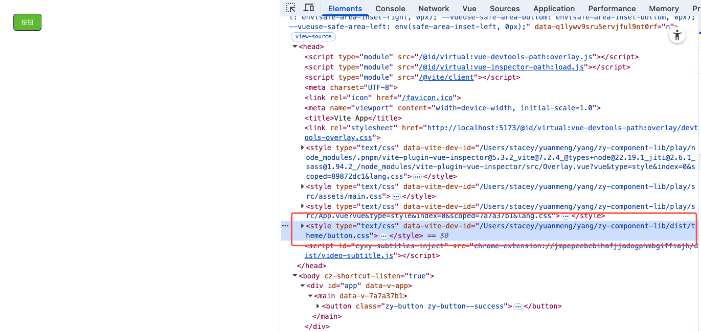

# 优化打包

可以看到现在虽然满足了样式按需引入，但是打包后的文件dist/button/style/index.ts是ts文件

所以我们要进行优化。

```js
import { defineConfig } from "vite" // 引入 Vite 官方方法，用于定义配置
import vue from "@vitejs/plugin-vue" // 引入 Vue 插件，支持 .vue 文件的编译
import dts from "vite-plugin-dts"    // 用于生成 TypeScript 类型声明文件 (.d.ts)
import { viteStaticCopy } from "vite-plugin-static-copy"
import path from "path"
import fs from "fs"


const packagesRoot = path.resolve(__dirname, "../packages")

function getStyleEntryFiles() {
  const dirs = fs.readdirSync(packagesRoot, { withFileTypes: true })

  return dirs
    .filter((dir) => dir.isDirectory())
    .map((dir) => path.resolve(packagesRoot, dir.name, "style/index.ts"))
    .filter((p) => fs.existsSync(p))
}

// const arr = getStyleEntryFiles().map((absPath) => {
//   // 生成类似 "button/style/index" 这样的 key，
//   // 在 preserveModules 下，会输出为 dist/button/style/index(.js)
//   const rel = path
//     .relative(packagesRoot, absPath)
//     .replace(/\.ts$/, "") // 去掉 .ts 后缀
//   return absPath
// })
// console.log('arr', arr)

// 把入口路径单独拿出来，方便在 lib.entry 和 rollupOptions.input 里复用
const libEntry = path.resolve(__dirname, "../packages/index.ts")
console.log('libEntry', libEntry)
// /Users/stacey/yuanmeng/yang/zy-component-lib/packages/index.ts

function getStyleCopyTargets() {
  const packagesDir = path.resolve(__dirname, "../packages")
  const dirs = fs.readdirSync(packagesDir, { withFileTypes: true })
  console.log('dirs', dirs)
  return dirs
    .filter((dir) => dir.isDirectory())
    .map((dir) => {
      const styleEntry = path.resolve(packagesDir, dir.name, "style/index.ts")
      if (!fs.existsSync(styleEntry)) return null
      return {
        src: styleEntry,
        dest: `${dir.name}/style`,
      }
    })
    .filter(Boolean) as { src: string; dest: string }[]
}

// 导出 Vite 配置
export default defineConfig({
  plugins: [
    vue(), // 使用 Vue 插件
    dts({
      entryRoot: path.resolve(__dirname, "../packages"), // 类型文件入口根目录，插件会扫描 packages 下的所有 TS/组件文件
      outDir: "dist/types", // 类型文件输出目录为 dist/types
      // 生成的 .d.ts 文件会按照目录结构保存在 dist/types 下
      insertTypesEntry: true, // 插入类型入口文件
      tsconfigPath: path.resolve(__dirname, "../tsconfig.build.json"),
    }),
    viteStaticCopy({
      targets: [
        // ...getStyleCopyTargets(),
        {
          src: path.resolve(__dirname, "../packages/theme"),
          dest: "",
        },
      ],
    }),
  ],
  build: {
    outDir: "dist", // 打包输出目录为 dist
    cssCodeSplit: true, // 按入口拆分 CSS，这样 button/style/index 会产出自己的 CSS，且 JS 里会带 import
    lib: {
      entry: [path.resolve(__dirname, "../packages/index.ts")], // 库入口文件
      name: "ZyComponentLib", // UMD/IIFE 模式下挂载到 window/global 的变量名
      fileName: (format, entryName) => `${entryName}.${format}.js`,
      // fileName: (format) => `index.${format}.js`, // 输出文件名，格式化为 es/cjs/umd
      // formats: ["es", "cjs", "umd"], // 输出格式：ESModule、CommonJS、UMD
      formats: ["es", "cjs"], // 输出格式：ESModule、CommonJS  umd会导致inlineDynamicImports为true,导致和preserveModules冲突
    },
    rollupOptions: {
      external: ["vue"], // 指定外部依赖，避免将 vue 打包进库
      input: {
        // 主库入口
        lib: libEntry,
        // 所有 style 入口
        ...Object.fromEntries(
          getStyleEntryFiles().map((absPath) => {
            // 生成类似 "button/style/index" 这样的 key，
            // 在 preserveModules 下，会输出为 dist/button/style/index(.js)
            const rel = path
              .relative(packagesRoot, absPath)
              .replace(/\.ts$/, "") // 去掉 .ts 后缀
            return [rel, absPath]
          }),
        ),
      },
      output: {
        exports: "named", // 避免同时使用 default 和 named 导出时的警告
        preserveModules: true,          // 如果开启，会保留原有目录结构，适合按需引入（注释掉表示不使用）
        preserveModulesRoot: "packages", // preserveModules 时的根目录
      },
    },
  },
})
```

问题：

文件packages/button/style/index.ts， 生成的 dist/button/style/index.es.js，内部是空的,因为packages/button/style/index.ts内部只有一行引入scss的语句，编译的时候，vite会单独处理css,导致打包后文件变空

# 解决

问题：

当一个 entry 文件只有 CSS import 时，Rollup 会认为它没有 JS 运行时代码，从而把 JS 清空。

- 首先我们先处理下theme文件夹，之前是用插件将theme拷贝到了dist，现在我们将它编译后再放入dist

`config/copy-style.ts`

```ts
import * as sass from "sass"
import fs from "fs"
import path from "path"
import fg from "fast-glob"

const themeDir = path.resolve("packages/theme")
const outDir = path.resolve("dist/theme")

if (!fs.existsSync(outDir)) {
  fs.mkdirSync(outDir, { recursive: true })
}

const files = fg.sync("*.scss", {
  cwd: themeDir,
})

files.forEach((file) => {
  const result = sass.compile(path.join(themeDir, file))

  const cssFile = file.replace(".scss", ".css")

  fs.writeFileSync(path.join(outDir, cssFile), result.css)
})

console.log("theme build success")
```

- 打包配置

```ts
import { defineConfig } from "vite" // 引入 Vite 官方方法，用于定义配置
import vue from "@vitejs/plugin-vue" // 引入 Vue 插件，支持 .vue 文件的编译
import dts from "vite-plugin-dts" // 用于生成 TypeScript 类型声明文件 (.d.ts)
import path from "path"
import fg from "fast-glob"

const packagesRoot = path.resolve(__dirname, "../packages")

const entryFiles = await fg("**/*.{js,ts,vue}", {
  cwd: path.resolve(__dirname, "../packages"),
  absolute: true,
  onlyFiles: true,
  ignore: ["**/__tests__/**"],
})

console.log("entryFiles", entryFiles)

// 把入口路径单独拿出来，方便在 lib.entry 和 rollupOptions.input 里复用
const libEntry = path.resolve(__dirname, "../packages/index.ts")
console.log("libEntry", libEntry)
// /Users/stacey/yuanmeng/yang/zy-component-lib/packages/index.ts

// 导出 Vite 配置
export default defineConfig({
  plugins: [
    vue(), // 使用 Vue 插件
    dts({
      entryRoot: path.resolve(__dirname, "../packages"), // 类型文件入口根目录，插件会扫描 packages 下的所有 TS/组件文件
      outDir: "dist/types", // 类型文件输出目录为 dist/types
      // 生成的 .d.ts 文件会按照目录结构保存在 dist/types 下
      insertTypesEntry: true, // 插入类型入口文件
      tsconfigPath: path.resolve(__dirname, "../tsconfig.build.json"),
    }),
  ],
  build: {
    outDir: "dist", // 打包输出目录为 dist
    cssCodeSplit: true, // 按入口拆分 CSS，这样 button/style/index 会产出自己的 CSS，且 JS 里会带 import
    lib: {
      entry: entryFiles, // 库入口文件
      name: "ZyComponentLib", // UMD/IIFE 模式下挂载到 window/global 的变量名
      fileName: (format, entryName) => `${entryName}.${format}.js`,
      // fileName: (format) => `index.${format}.js`, // 输出文件名，格式化为 es/cjs/umd
      // formats: ["es", "cjs", "umd"], // 输出格式：ESModule、CommonJS、UMD
      formats: ["es", "cjs"], // 输出格式：ESModule、CommonJS  umd会导致inlineDynamicImports为true,导致和preserveModules冲突
    },
    rollupOptions: {
      external: ["vue"], // 指定外部依赖，避免将 vue 打包进库
      output: {
        exports: "named", // 避免同时使用 default 和 named 导出时的警告
        preserveModules: true, // 如果开启，会保留原有目录结构，适合按需引入（注释掉表示不使用）
        preserveModulesRoot: "packages", // preserveModules 时的根目录
      },
    },
  },
})
```

删除一些不必要的配置

- 处理style/index.ts
  将style/index.ts文件中的内容，scss改为css,再拷贝到对应的dist目录中

```js
import fs from "fs"
import path from "path"
import fg from "fast-glob"

const root = process.cwd()

// packages 目录
const packagesDir = path.resolve(root, "packages")

// dist 输出目录
const distDir = path.resolve(root, "dist")

async function copyStyle() {
  // 找到所有 style/index.ts
  const files = await fg("*/style/index.ts", {
    cwd: packagesDir,
  })

  for (const file of files) {
    const absPath = path.resolve(packagesDir, file)

    let content = fs.readFileSync(absPath, "utf-8")

    // 把 scss 改成 css
    content = content.replace(/\.scss/g, ".css")

    // 输出路径
    const outFile = path.resolve(distDir, file.replace(".ts", ".js"))

    // 创建目录
    fs.mkdirSync(path.dirname(outFile), { recursive: true })

    // 写入文件
    fs.writeFileSync(outFile, content)
  }

  console.log("style copied successfully")
}

copyStyle()
```

# package.json

```json
{
  "build": "tsx ./config/build-theme.ts && vite build --config ./config/vite.config.prod.ts && tsx ./config/copy-style.ts"
}
```

打包目录

```js
├── dist
│   ├── button
│   │   ├── index.cjs.js
│   │   ├── index.es.js
│   │   ├── src
│   │   │   ├── button.vue.cjs.js
│   │   │   ├── button.vue.cjs2.js
│   │   │   ├── button.vue.es.js
│   │   │   └── button.vue.es2.js
│   │   └── style
│   │       ├── index.cjs.js
│   │       ├── index.es.js
│   │       └── index.js
│   ├── index.cjs.js
│   ├── index.es.js
│   ├── theme
│   │   └── button.css
│   ├── types
│   │   ├── button
│   │   │   ├── index.d.ts
│   │   │   ├── src
│   │   │   └── style
│   │   ├── button.vue.d.ts
│   │   ├── index.d.ts
│   │   ├── resolver.d.ts
│   │   ├── utils
│   │   │   ├── resolver.d.ts
│   │   │   └── withInstall.d.ts
│   │   └── withInstall.d.ts
│   ├── utils
│   │   ├── resolver.cjs.js
│   │   ├── resolver.es.js
│   │   ├── withInstall.cjs.js
│   │   └── withInstall.es.js
│   └── vite.svg
```

此时
dist/button/style/index.js
```js
import '../../theme/button.css'
```

运行play检验


